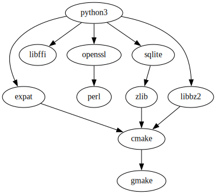

# python3-setup

a command-line tool to setup [CPython3](https://www.python.org/)

## dependences

|dependency|required?|purpose|
|----|---------|-------|
|[cmake](https://cmake.org/)|required |for generating `build.ninja`|
|[ninja](https://ninja-build.org/)|required |for doing jobs that read from `build.ninja`|
|[pkg-config>=0.18](https://www.freedesktop.org/wiki/Software/pkg-config/)|required|for finding libraries.|
||||
|[libyaml](https://github.com/yaml/libyaml/)|required|for parsing formulas whose format is YAML.|
|[libcurl](https://curl.se/)|required|for http requesting support.|
|[openssl](https://www.openssl.org/)|required|for https requesting support and SHA-256 sum checking support.|
|[libarchive](https://www.libarchive.org/)|required|for uncompressing .zip and .tar.* files.|
|[zlib](https://www.zlib.net/)|required|for compressing and uncompressing.|

## install `python3-setup` prebuild binary

go to <https://github.com/leleliu008/python3-setup/releases>

## build and install python3-setup via [ppkg](https://github.com/leleliu008/ppkg)

```bash
ppkg install python3-setup
```

## build and install python3-setup via [xcpkg](https://github.com/leleliu008/xcpkg)

```bash
xcpkg install MacOSX/10.15/x86_64/python3-setup
xcpkg install MacOSX/11.0/arm64/python3-setup
```

## build and install `python3-setup` using [vcpkg](https://github.com/microsoft/vcpkg)

**Note:** This is the recommended way to build and install python3-setup.

```bash
# install g++ curl zip unzip tar git

git clone https://github.com/microsoft/vcpkg.git
cd vcpkg
./bootstrap-vcpkg.sh
./vcpkg install curl openssl libarchive libyaml

cd -

git clone https://github.com/leleliu008/python3-setup
cd python3-setup

cmake -S . -B   build.d -G Ninja -DCMAKE_INSTALL_PREFIX=/usr/local -DCMAKE_TOOLCHAIN_FILE=$VCPKG_ROOT/scripts/buildsystems/vcpkg.cmake
cmake --build   build.d
cmake --install build.d
```

## build and install `python3-setup` using your system's default package manager

**[Ubuntu](https://ubuntu.com/)**

```bash
apt -y update
apt -y install git cmake ninja-build pkg-config gcc libcurl4 libcurl4-openssl-dev libarchive-dev libyaml-dev

git clone https://github.com/leleliu008/python3-setup
cd python3-setup

cmake -S . -B   build.d -G Ninja -DCMAKE_INSTALL_PREFIX=/usr/local
cmake --build   build.d
cmake --install build.d
```

**[Fedora](https://getfedora.org/)**

```bash
dnf -y update
dnf -y install git cmake ninja-build pkg-config gcc libcurl-devel openssl-devel libarchive-devel libyaml-devel zlib-devel

git clone https://github.com/leleliu008/python3-setup
cd python3-setup

cmake -S . -B   build.d -G Ninja -DCMAKE_INSTALL_PREFIX=/usr/local
cmake --build   build.d
cmake --install build.d
```

**[ArchLinux](https://archlinux.org/)**

```bash
pacman -Syyuu --noconfirm
pacman -S     --noconfirm git cmake ninja pkg-config gcc curl openssl libarchive libyaml

git clone https://github.com/leleliu008/python3-setup
cd python3-setup

cmake -S . -B   build.d -G Ninja -DCMAKE_INSTALL_PREFIX=/usr/local
cmake --build   build.d
cmake --install build.d
```

**[AlpineLinux](https://www.alpinelinux.org/)**

```bash
apk add git cmake ninja pkgconf gcc libc-dev curl-dev openssl-dev libarchive-dev yaml-dev

git clone https://github.com/leleliu008/python3-setup
cd python3-setup

cmake -S . -B   build.d -G Ninja -DCMAKE_INSTALL_PREFIX=/usr/local
cmake --build   build.d
cmake --install build.d
```

**[VoidLinux](https://voidlinux.org/)**

```bash
xbps-install -Suy xbps
xbps-install -Suy cmake ninja gcc pkg-config libcurl-devel libarchive-devel libyaml-devel

git clone https://github.com/leleliu008/python3-setup
cd python3-setup

cmake -S . -B   build.d -G Ninja -DCMAKE_INSTALL_PREFIX=/usr/local
cmake --build   build.d
cmake --install build.d
```

**[Gentoo Linux](https://www.gentoo.org/)**

```bash
emerge dev-vcs/git cmake dev-util/ninja gcc pkg-config net-misc/curl libarchive dev-libs/libyaml

git clone https://github.com/leleliu008/python3-setup
cd python3-setup

cmake -S . -B   build.d -G Ninja -DCMAKE_INSTALL_PREFIX=/usr/local
cmake --build   build.d
cmake --install build.d
```

**[openSUSE](https://www.opensuse.org/)**

```bash
zypper update  -y  
zypper install -y git cmake ninja gcc pkg-config libcurl-devel openssl-devel libarchive-devel libyaml-devel zlib-devel

git clone https://github.com/leleliu008/python3-setup
cd python3-setup

cmake -S . -B   build.d -G Ninja -DCMAKE_INSTALL_PREFIX=/usr/local
cmake --build   build.d
cmake --install build.d
```

**[macOS](https://www.apple.com/macos/)**

```bash
brew update
brew install git cmake pkg-config ninja curl libyaml libarchive

git clone https://github.com/leleliu008/python3-setup
cd python3-setup

export PKG_CONFIG_PATH="/usr/local/lib/pkgconfig:/usr/local/opt/openssl@1.1/lib/pkgconfig:/usr/local/opt/curl/lib/pkgconfig:/usr/local/opt/libarchive/lib/pkgconfig"

CMAKE_EXE_LINKER_FLAGS='-L/usr/local/lib -L/usr/local/opt/openssl@1.1/lib -lssl -liconv -framework CoreFoundation -framework Security'
CMAKE_FIND_ROOT_PATH="$(brew --prefix openssl@1.1);$(brew --prefix curl);$(brew --prefix libarchive)"

cmake \
    -S . \
    -B build.d \
    -G Ninja \
    -DCMAKE_INSTALL_PREFIX=./output \
    -DCMAKE_EXE_LINKER_FLAGS="$CMAKE_EXE_LINKER_FLAGS" \
    -DCMAKE_FIND_ROOT_PATH="$CMAKE_FIND_ROOT_PATH"

cmake --build   build.d
cmake --install build.d
```

**[FreeBSD](https://www.freebsd.org/)**

```bash
pkg install -y git cmake ninja pkgconf gcc curl openssl libarchive libyaml

git clone https://github.com/leleliu008/python3-setup
cd python3-setup

cmake -S . -B   build.d -G Ninja -DCMAKE_INSTALL_PREFIX=/usr/local
cmake --build   build.d
cmake --install build.d
```

**[OpenBSD](https://www.openbsd.org/)**

```bash
pkg_add git cmake ninja pkgconf llvm curl libarchive libyaml

git clone https://github.com/leleliu008/python3-setup
cd python3-setup

cmake -S . -B   build.d -G Ninja -DCMAKE_INSTALL_PREFIX=/usr/local
cmake --build   build.d
cmake --install build.d
```

**[NetBSD](https://www.netbsd.org/)**

```bash
pkgin -y install git mozilla-rootcerts cmake ninja-build pkg-config clang curl openssl libarchive libyaml

mozilla-rootcerts install

git clone https://github.com/leleliu008/python3-setup
cd python3-setup

cmake -S . -B   build.d -G Ninja -DCMAKE_INSTALL_PREFIX=/usr/local
cmake --build   build.d
cmake --install build.d
```

## ~/.python3-setup

all relevant dirs and files are located in `~/.python3-setup` directory.

**Note**: Please do NOT place your own files in `~/.python3-setup` directory, as `python3-setup` will change files in `~/.python3-setup` directory without notice.

## python3-setup command usage

- **show help of this command**

    ```bash
    python3-setup -h
    python3-setup --help
    ```

- **show version of this command**

    ```bash
    python3-setup -V
    python3-setup --version
    ```

- **show your system's information**

    ```bash
    python3-setup sysinfo
    ```

- **show your system's information and other information**

    ```bash
    python3-setup env
    ```

- **show default config**

    ```bash
    python3-setup show-default-config
    python3-setup show-default-config > config.yml
    ```

- **setup GNU Autotools and relevant build environment**

    ```bash
    python3-setup setup
    python3-setup setup --prefix=.python3
    python3-setup setup --prefix=.python3 --jobs=8
    python3-setup setup --prefix=.python3 --config=my-config.yml
    python3-setup setup --prefix=.python3 -v
    ```

    **Note**: C compiler should be installed by yourself using your system's default package manager before running this command.

    **Tip:** above command do two things:

  - download `gmake` prebuild binary from <https://github.com/leleliu008/gmake-build/releases>
  - build packages [zlib](https://zlib.net/) [libbz2](https://github.com/leleliu008/bzip2) [libffi](https://github.com/libffi/libffi) [expat](https://github.com/libexpat/libexpat) [perl](https://www.perl.org/) [openssl](https://github.com/openssl/openssl) [python3](https://www.python.org/)

  **More:** following graph shows the relationships between these packages when building:

  

- **extra common used utilities**

    ```bash
    python3-setup util zlib-deflate -L 6 < input/file/path
    python3-setup util zlib-inflate      < input/file/path

    python3-setup util base16-encode "string to be encoded with base16 algorithm"
    python3-setup util base16-encode < input/file/path

    python3-setup util base16-decode ABCD
    python3-setup util base16-decode ABCD > output/file/path

    python3-setup util base64-encode "string to be encoded with base64 algorithm"
    python3-setup util base64-encode < input/file/path

    python3-setup util base64-decode YQ==
    python3-setup util base64-decode YQ== > output/file/path

    python3-setup util sha256sum   input/file/path
    python3-setup util sha256sum < input/file/path

    python3-setup util which tree
    python3-setup util which tree -a
    ```

## environment variables

- **HOME**

    this environment variable already have been set on most systems, if not set or set a empty string, you will receive an error message.

- **PATH**

    this environment variable already have been set on most systems, if not set or set a empty string, you will receive an error message.

- **SSL_CERT_FILE**

    ```bash
    curl -LO https://curl.se/ca/cacert.pem
    export SSL_CERT_FILE="$PWD/cacert.pem"
    ```

    In general, you don't need to set this environment variable, but, if you encounter the reporting `the SSL certificate is invalid`, trying to run above commands in your terminal will do the trick.

## config

If default config dosn't meets your needs, you can specify your config via `--config=your/config/file/path`

config is a [YAML](https://yaml.org/spec/1.2.2/) format file.

**example**:

```yml
src-url-python3: https://www.python.org/ftp/python/3.11.2/Python-3.11.2.tgz
src-sha-python3: 2411c74bda5bbcfcddaf4531f66d1adc73f247f529aee981b029513aefdbf849

src-url-openssl: https://www.openssl.org/source/openssl-3.0.5.tar.gz
src-sha-openssl: aa7d8d9bef71ad6525c55ba11e5f4397889ce49c2c9349dcea6d3e4f0b024a7a

src-url-libffi:  https://github.com/libffi/libffi/releases/download/v3.4.4/libffi-3.4.4.tar.gz
src-sha-libffi:  d66c56ad259a82cf2a9dfc408b32bf5da52371500b84745f7fb8b645712df676

src-url-sqlite:  https://www.sqlite.org/2023/sqlite-autoconf-3410100.tar.gz
src-sha-sqlite:  4dadfbeab9f8e16c695d4fbbc51c16b2f77fb97ff4c1c3d139919dfc038c9e33

src-url-libbz2:  https://github.com/leleliu008/bzip2/archive/refs/tags/1.0.8.tar.gz
src-sha-libbz2:  0100da0b55f552134d732acdd0325e84a0ef731a305c15f6a2ea24308de09759

src-url-expat:   https://github.com/libexpat/libexpat/releases/download/R_2_5_0/expat-2.5.0.tar.xz
src-sha-expat:   ef2420f0232c087801abf705e89ae65f6257df6b7931d37846a193ef2e8cdcbe

src-url-zlib:    https://zlib.net/zlib-1.2.13.tar.gz
src-sha-zlib:    b3a24de97a8fdbc835b9833169501030b8977031bcb54b3b3ac13740f846ab30

src-url-perl:    https://cpan.metacpan.org/authors/id/R/RJ/RJBS/perl-5.36.0.tar.xz
src-sha-perl:    0f386dccbee8e26286404b2cca144e1005be65477979beb9b1ba272d4819bcf0
```
